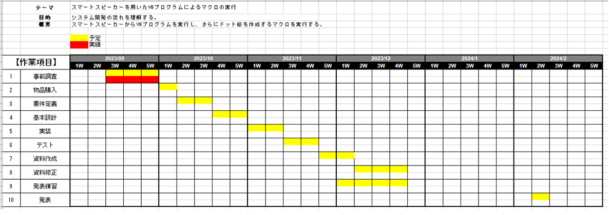

### 次回発表は12月16日
* スケジュール

- 進捗は実装を少し進めた
  - 設計はいったん放置

1. N1テーマの選定理由を説明するとき詰まりがち
2. リスケしたタイミングを示してほしい
3. テーマを変更した説明はなし

5. 選定理由が甘い
6. 全部で何行書いたか、なぜここを切り抜いたか
言語

報連相の向上に向けて実際に何か意識したことあるか

12/16発表議事

浅田さん
テーマ名は筋トレ手帳のほうが良いのではないか?
→筋トレ手帳のほうがかっこいい

5p 具体的な動作に例が欲しい
記録時に日時も出力してほしい?

関口さん
alexaを使った所感をスライドに追加してほしい(alexaのセールス)

山口さん
設計と実装を平行して行うことはどうなのか(どこまでが仕様として決まっていてどこからが設計の範疇に含まれるのか)
→仕様としての要件定義は完了しており、設計はフローチャート等のumlを作成する

原さん
終わりの処理をどうするのか
→これから作成する
設計資料をなるべく発表資料に入れてほしい

大塚さん
記録後の内容を発表資料に入れてほしい。

報連相の意識
→要件定義等の区切りで連絡するようにしている

山口さん
エクセル出力フォーマットは決まっているのか
→まだ決まっていない。

古い日付のデータはどうするのか
→今のところ1ファイルにすべてまとめる
