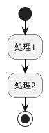

# ReadMe

## plantuml sample

出力結果

[plantumlインストール方法](https://qiita.com/couzie/items/9dedb834c5aff09ea7b2)
[plantumlチートシート](https://qiita.com/ogomr/items/0b5c4de7f38fd1482a48)

* バッチファイル: Windowsのコマンドを実行してくれるファイル(MacOSやLinuxはshellスクリプト)
* VBS(Visual Basic Scripting Edition) :Microsoftが開発したスクリプトプログラミング言語

スマートスピーカー比較
|項目|Alexa|Google Nest|HomePod|
|---|---|---|---|
|メーカー|Amazon|Google|Apple|
|AI|Alexa|Googleアシスタント|Siri|
|価格帯|6k～30k|6k or 15k|15k or 45k|
|開発|[Alexa Skills Kit(ASK)](https://developer.amazon.com/ja-JP/alexa/alexa-skills-kit)|[Actions on Google](https://developers.google.com/assistant/smarthome/overview?hl=ja)|[SiriKit](https://learn.microsoft.com/ja-jp/xamarin/ios/platform/sirikit/understanding-sirikit)|

