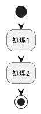
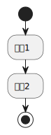

# ReadMe

<!-- @import "[TOC]" {cmd="toc" depthFrom=2 depthTo=3 orderedList=false} -->

<!-- code_chunk_output -->

- [plantuml sample](#plantuml-sample)
  - [出力結果](#出力結果)
  - [インストール方法やチートシート](#インストール方法やチートシート)
- [スマートスピーカー比較](#スマートスピーカー比較)
  - [選考理由例](#選考理由例)
- [現行Alexa比較](#現行alexa比較)
  - [選考理由例](#選考理由例-1)
- [その他メモ](#その他メモ)

<!-- /code_chunk_output -->

## plantuml sample

### 出力結果

### インストール方法やチートシート
[plantumlインストール方法](https://qiita.com/couzie/items/9dedb834c5aff09ea7b2)

[plantumlチートシート](https://qiita.com/ogomr/items/0b5c4de7f38fd1482a48)

## スマートスピーカー比較

* 予算は15k
* 別に何を選んでもいいけどそれっぽい理由が言えるようにしておく黒虎と

|項目|Alexa|Google Nest|HomePod|
|---|---|---|---|
|メーカー|Amazon|Google|Apple|
|AI|Alexa|Googleアシスタント|Siri|
|価格帯|6k～30k|6k or 15k|15k or 45k|
|開発|[Alexa Skills Kit(ASK)](https://developer.amazon.com/ja-JP/alexa/alexa-skills-kit)|[Actions on Google](https://developers.google.com/assistant/smarthome/overview?hl=ja)|[SiriKit](https://learn.microsoft.com/ja-jp/xamarin/ios/platform/sirikit/understanding-sirikit)|
|開発の難易度見積もり|簡単そう|簡単そう|難しそう|

### 選考理由例

* 価格帯と開発の難易度見積もりによりAlexaとGoogle Nestの2つが優位となった
* google nestの購入が専用サイトでしか行えず経費で落とせない、alazonの方が個人的に応援している
上記の理由によりAlexaを購入することに決定。

## 現行Alexa比較

|項目|Echo|Echo Dot|Echo Dot with clock|Echo Pop|Echo Show 5|
|---|---|---|---|---|---|
|値段|12k|7.5k|8.5k|6k|10k|
|バージョン|第4世代|第5世代|第5世代|/|第3世代|
|url|[Echo](https://www.amazon.co.jp/Echo-%E3%82%A8%E3%82%B3%E3%83%BC-%E7%AC%AC4%E4%B8%96%E4%BB%A3-%E3%82%B9%E3%83%9E%E3%83%BC%E3%83%88%E3%82%B9%E3%83%94%E3%83%BC%E3%82%AB%E3%83%BC-with-Alexa-%E3%83%81%E3%83%A3%E3%82%B3%E3%83%BC%E3%83%AB/dp/B085G2227B/ref=sr_1_2?keywords=echo&qid=1697125311&sr=8-2)|[Echo Dot](https://www.amazon.co.jp/Echo-Dot-%E3%82%A8%E3%82%B3%E3%83%BC%E3%83%89%E3%83%83%E3%83%88-%E7%AC%AC5%E4%B8%96%E4%BB%A3-Alexa-%E3%82%BB%E3%83%B3%E3%82%B5%E3%83%BC%E6%90%AD%E8%BC%89-%E9%AE%AE%E3%82%84%E3%81%8B%E3%81%AA%E3%82%B5%E3%82%A6%E3%83%B3%E3%83%89-%E3%83%81%E3%83%A3%E3%82%B3%E3%83%BC%E3%83%AB/dp/B09B8SZLLG/ref=sr_1_6?keywords=echo&qid=1697125311&sr=8-6)|[Echo Dot with clock](https://www.amazon.co.jp/Echo-Dot-with-clock-%E3%82%A8%E3%82%B3%E3%83%BC%E3%83%89%E3%83%83%E3%83%88%E3%82%A6%E3%82%A3%E3%82%BA%E3%82%AF%E3%83%AD%E3%83%83%E3%82%AF-%E7%AC%AC5%E4%B8%96%E4%BB%A3-%E6%99%82%E8%A8%88%E4%BB%98%E3%81%8D%E3%82%B9%E3%83%9E%E3%83%BC%E3%83%88%E3%82%B9%E3%83%94%E3%83%BC%E3%82%AB%E3%83%BC-with-Alexa-%E3%82%AF%E3%83%A9%E3%82%A6%E3%83%89%E3%83%96%E3%83%AB%E3%83%BC/dp/B09B8RXYM3/ref=sr_1_1?keywords=echo&qid=1697125311&sr=8-1)|[Echo Pop](https://www.amazon.co.jp/Echo-Dot-with-clock-%E3%82%A8%E3%82%B3%E3%83%BC%E3%83%89%E3%83%83%E3%83%88%E3%82%A6%E3%82%A3%E3%82%BA%E3%82%AF%E3%83%AD%E3%83%83%E3%82%AF-%E7%AC%AC5%E4%B8%96%E4%BB%A3-%E6%99%82%E8%A8%88%E4%BB%98%E3%81%8D%E3%82%B9%E3%83%9E%E3%83%BC%E3%83%88%E3%82%B9%E3%83%94%E3%83%BC%E3%82%AB%E3%83%BC-with-Alexa-%E3%82%AF%E3%83%A9%E3%82%A6%E3%83%89%E3%83%96%E3%83%AB%E3%83%BC/dp/B09B8RXYM3/ref=sr_1_1?keywords=echo&qid=1697125311&sr=8-1)|[Echo Show 5](https://www.amazon.co.jp/Echo-Show-5-%E3%82%A8%E3%82%B3%E3%83%BC%E3%82%B7%E3%83%A7%E3%83%BC5-%E7%AC%AC3%E4%B8%96%E4%BB%A3-%E3%82%B9%E3%83%9E%E3%83%BC%E3%83%88%E3%83%87%E3%82%A3%E3%82%B9%E3%83%97%E3%83%AC%E3%82%A4-with-Alexa-%E3%82%AF%E3%83%A9%E3%82%A6%E3%83%89%E3%83%96%E3%83%AB%E3%83%BC/dp/B09B2T3QBN/ref=sr_1_4?keywords=echo&qid=1697125311&sr=8-4)|

### 選考理由例
* 価格が高いほうが拡張性が高いと考えられるため、予算を最大に活かせるxに決定
* どの製品でも目標実現は可能と考えられたため、一番コストを抑えられるyに決定
* どの製品で目標が実現できるかわからなかったため、ミドルタイプのzに決定

## その他メモ

* バッチファイル: Windowsのコマンドを実行してくれるファイル(MacOSやLinuxはshellスクリプト)
* VBS(Visual Basic Scripting Edition) :Microsoftが開発したスクリプトプログラミング言語
